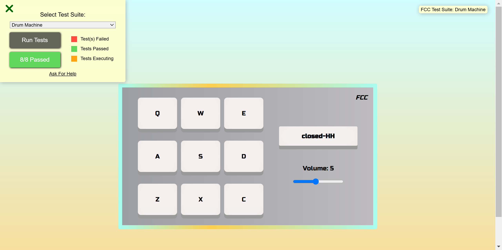

<div align="center" class="container">
<picture>
  <a href=""></a>
</picture>
<h3  align="center">Drum Machine</h3>
  </div>
</div>

## <br /> 📋 <a name="table">Summary</a>

- ✨ [Introduction](#introduction)
- 🛠 [Technology Used](#tech-stack)
- 🚀 [Launch App](#launch-app)
- 🎨 [Styling](#style)

## <br /> <a name="introduction">✨ Introduction</a>

Third project FreeCodeCamp to valid the certification "Front End Development Libraries"

**User Story :**

- User Story #1: I should be able to see an outer container with a corresponding id="drum-machine" that contains all other elements.

- User Story #2: Within #drum-machine I can see an element with a corresponding id="display".

- User Story #3: Within #drum-machine I can see 9 clickable drum pad elements, each with a class name of drum-pad, a unique id that describes the audio clip the drum pad will be set up to trigger, and an inner text that corresponds to one of the following keys on the keyboard: Q, W, E, A, S, D, Z, X, C. The drum pads MUST be in this order.

- User Story #4: Within each .drum-pad, there should be an HTML5 audio element which has a src attribute pointing to an audio clip, a class name of clip, and an id corresponding to the inner text of its parent .drum-pad (e.g. id="Q", id="W", id="E" etc.).

- User Story #5: When I click on a .drum-pad element, the audio clip contained in its child audio element should be triggered.

- User Story #6: When I press the trigger key associated with each .drum-pad, the audio clip contained in its child audio element should be triggered (e.g. pressing the Q key should trigger the drum pad which contains the string Q, pressing the W key should trigger the drum pad which contains the string W, etc.).

- User Story #7: When a .drum-pad is triggered, a string describing the associated audio clip is displayed as the inner text of the #display element (each string must be unique).

**Audio samples use for my drum machine:**

- [Heater 1](https://cdn.freecodecamp.org/testable-projects-fcc/audio/Heater-1.mp3)
- [Heater 2](https://cdn.freecodecamp.org/testable-projects-fcc/audio/Heater-2.mp3)
- [Heater 3](https://cdn.freecodecamp.org/testable-projects-fcc/audio/Heater-3.mp3)
- [Heater 4](https://cdn.freecodecamp.org/testable-projects-fcc/audio/Heater-4_1.mp3)
- [Clap](https://cdn.freecodecamp.org/testable-projects-fcc/audio/Heater-6.mp3)
- [Open-HH](https://cdn.freecodecamp.org/testable-projects-fcc/audio/Dsc_Oh.mp3)
- [Kick-n'-Hat](https://cdn.freecodecamp.org/testable-projects-fcc/audio/Kick_n_Hat.mp3)
- [Kick](https://cdn.freecodecamp.org/testable-projects-fcc/audio/RP4_KICK_1.mp3)
- [Closed-HH](https://cdn.freecodecamp.org/testable-projects-fcc/audio/Cev_H2.mp3)


## <br /> <a name="tech-stack">🛠 Technology Used</a>

- [Sass](https://sass-lang.com/install/)
Providing advanced features like variables, nesting, and mixins for more efficient and maintainable styling. Sass allows developers to write more complex and reusable CSS, reducing the amount of duplicate code and simplifying the design process.

- [sass-embedded](https://www.npmjs.com/package/sass-embedded)
This package provides the same JavaScript API as the sass package, and can be used as a drop-in replacement, Unlike the sass package, the asynchronous API in sass-embedded will generally be faster than the synchronous API since the Sass compilation logic is happening in a different process.


## <br /> <a name="launch-app">🚀 Launch App</a>

Follow these steps to set up the project locally on your machine.

**Prerequisites**

>[!NOTE]
> Make sure you have the following installed on your machine:

- [Git](https://git-scm.com/)
- [Node.js](https://nodejs.org/en)
- [npm](https://www.npmjs.com/) *(Node Package Manager)*

**Cloning the Repository**

```bash
git clone {git remote URL}
cd {git project..}
```

**Installation**

> After cloning the repository, run the command `npm i` or `yarn i` to install the project's dependencies.

_npm_

```
npm install 
```

_yarn_

```
yarn install
```

> Once the dependencies are installed, start the project with the command `npm run dev`.

## <br /> <a name="style">🎨 Styling</a>

Global styling are defined using **SCSS**

<details>
<summary><code>App.scss</code></summary>

```css

@import url("https://fonts.googleapis.com/css2?family=Russo+One&display=swap");

:root {
  --font-Russo: "Russo One", sans-serif;
  --bg-i-drum: linear-gradient(to top, #fddb92 0%, #d1fdff 100%);
  --bg-pad: linear-gradient(to left, #bdbbbe 0%, #9d9ea3 100%),
    radial-gradient(
      88% 271%,
      rgba(255, 255, 255, 0.25) 0%,
      rgba(254, 254, 254, 0.25) 1%,
      rgba(0, 0, 0, 0.25) 100%
    ),
    radial-gradient(
      50% 100%,
      rgba(255, 255, 255, 0.3) 0%,
      rgba(0, 0, 0, 0.3) 100%
    );
  --bg-btn: radial-gradient(73% 147%, #eadfdf 59%, #ece2df 100%),
    radial-gradient(
      91% 146%,
      rgba(255, 255, 255, 0.5) 47%,
      rgba(0, 0, 0, 0.5) 100%
    );
  --border-gradient: linear-gradient(
    90deg,
    #a9fbed  0%,
    #fdcf4f 35%,
    #a9fbed 100%
  );
}

@tailwind base;
@tailwind components;
@tailwind utilities;

*,
::before,
::after {
  padding: 0;
  margin: 0;
  box-sizing: border-box;
}

@mixin flex($justify-content, $align-items) {
  display: flex;
  justify-content: $justify-content;
  align-items: $align-items;
}

@mixin content($border-radius) {
  background-image: var(--bg-btn);
  background-blend-mode: screen;
  border: none;
  border-radius: $border-radius;
  box-shadow: 0 9px #999;
  outline: none;
}

@mixin borderColor() {
  border-radius: 4px;
  border: 10px solid;
  border-image-slice: 1;
  border-image-source: var(--border-gradient);
}

body {
  @include flex(center, center);
  margin-top: 5rem;
  min-height: 100vh;
  background-size: cover;
  padding: 2rem;
  background-image: var(--bg-i-drum);
}

main {
  @include flex(space-evenly, center);
  background-image: var(--bg-pad);
  background-blend-mode: normal, lighten, soft-light;
  width: 660px;
  padding: 1rem 0;
  text-align: center;
  font-family: var(--font-Russo);
  position: relative;
  @include borderColor();
}

#drum-machine {
  display: grid;
  grid-template-columns: 100px 100px 100px;
  grid-template-rows: 100px 100px 100px;
  align-items: center;
  gap: 10px;

  .drum-pad {
    @include flex(center, center);
    @include content(8px);
    height: 80%;

    cursor: pointer;
    &:hover {
      background-color: #3e8e41;
    }
    &:active {
      background-color: #3e8e41;
      box-shadow: 0 5px #666;
      transform: translateY(4px);
    }
  }
}

.logo {
  margin-top: 1rem;
  font-style: italic;
  display: flex;
  align-items: center;
  position: absolute;
  top: 0;
  right: 15px;
  i {
    font-weight: bold;
    font-style: italic;
    font-size: 20px;
  }
}
#pad {
  @include flex(center, center);
  flex-direction: column;
  gap: 2rem;

.form-label {
  @include flex(center, center);
  margin: 1rem 0;
}
  #display {
    @include content(3px);
    width: 200px;
    font-size: 1rem;
    font-weight: bold;
    padding: 15px;
  }
}


```
</details>

