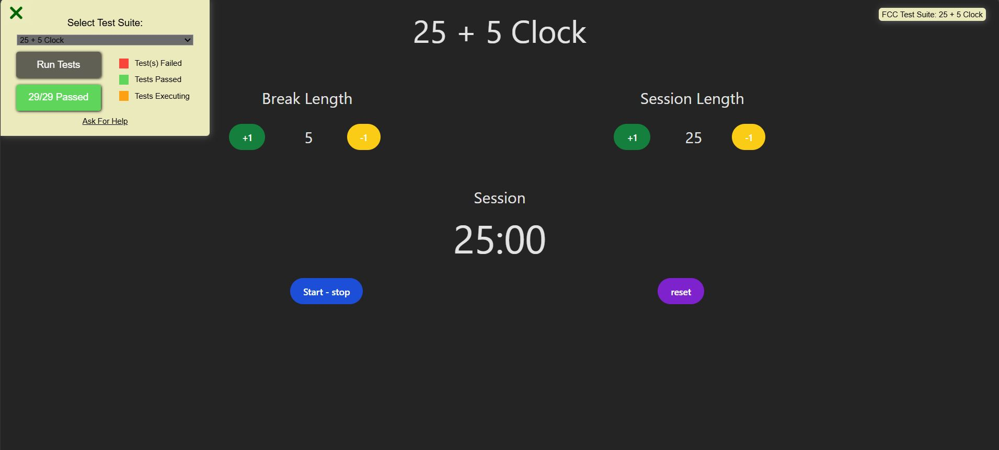

<div align="center">
  <a href="https://fcc-clock-cm.netlify.app/" target="_blanck"></a>
   <div>
    
    
    
</div>
  <h3 align="center">25 + 5 Clock</h3>
</div>

## <br /> 📋 <a name="table">Summary</a>

- ✨ [Introduction](#introduction)
- 🛠 [Technology Used](#tech-stack)
- 🚀 [Launch App](#launch-app)

## <br /> <a name="introduction">✨ Introduction</a>

Fifth project FreeCodeCamp to valid the certification "Front End Development Libraries"

**User Story :**

# Content

- User Story #1: I can see an element with id="break-label" that contains a string (e.g. "Break Length"). ✅

- User Story #2: I can see an element with id="session-label" that contains a string (e.g. "Session Length"). ✅

- User Story #3: I can see two clickable elements with corresponding IDs: id="break-decrement" and id="session-decrement". ✅

- User Story #4: I can see two clickable elements with corresponding IDs: id="break-increment" and id="session-increment". ✅ 

- User Story #5: I can see an element with a corresponding id="break-length", which by default (on load) displays a value of 5. ✅

- User Story #6: I can see an element with a corresponding id="session-length", which by default displays a value of 25. ✅

- User Story #7: I can see an element with a corresponding id="timer-label", that contains a string indicating a session is initialized (e.g. "Session"). ✅

- User Story #8: I can see an element with corresponding id="time-left". NOTE: Paused or running, the value in this field should always be displayed in mm:ss format (i.e. 25:00). ✅

- User Story #9: I can see a clickable element with a corresponding id="start_stop". ✅

- User Story #10: I can see a clickable element with a corresponding id="reset". ✅

# Timer

- User Story #11: When I click the element with the id of reset, any running timer should be stopped, the value within id="break-length" should return to 5, the value within id="session-length" should return to 25, and the element with id="time-left" should reset to its default state. ✅

- User Story #12: When I click the element with the id of break-decrement, the value within id="break-length" decrements by a value of 1, and I can see the updated value. ✅

- User Story #13: When I click the element with the id of break-increment, the value within id="break-length" increments by a value of 1, and I can see the updated value. ✅

- User Story #14: When I click the element with the id of session-decrement, the value within id="session-length" decrements by a value of 1, and I can see the updated value. ✅

- User Story #15: When I click the element with the id of session-increment, the value within id="session-length" increments by a value of 1, and I can see the updated value. ✅

- User Story #16: I should not be able to set a session or break length to <= 0. ✅

- User Story #17: I should not be able to set a session or break length to > 60. ✅

- User Story #18: When I first click the element with id="start_stop", the timer should begin running from the value currently displayed in id="session-length", even if the value has been incremented or decremented from the original value of 25. ✅

- User Story #19: If the timer is running, the element with the id of time-left should display the remaining time in mm:ss format (decrementing by a value of 1 and updating the display every 1000ms). ✅

- User Story #20: If the timer is running and I click the element with id="start_stop", the countdown should pause. ✅

- User Story #21: If the timer is paused and I click the element with id="start_stop", the countdown should resume running from the point at which it was paused. ✅

- User Story #22: When a session countdown reaches zero (NOTE: timer MUST reach 00:00), and a new countdown begins, the element with the id of timer-label should display a string indicating a break has begun. ✅ 

- User Story #23: When a session countdown reaches zero (NOTE: timer MUST reach 00:00), a new break countdown should begin, counting down from the value currently displayed in the id="break-length" element. ✅

- User Story #24: When a break countdown reaches zero (NOTE: timer MUST reach 00:00), and a new countdown begins, the element with the id of timer-label should display a string indicating a session has begun.✅

- User Story #25: When a break countdown reaches zero (NOTE: timer MUST reach 00:00), a new session countdown should begin, counting down from the value currently displayed in the id="session-length" element.✅

# Audio

- User Story #26: When a countdown reaches zero (NOTE: timer MUST reach 00:00), a sound indicating that time is up should play. This should utilize an HTML5 audio tag and have a corresponding id="beep".✅

- User Story #27: The audio element with id="beep" must be 1 second or longer.✅

- User Story #28: The audio element with id of beep must stop playing and be rewound to the beginning when the element with the id of reset is clicked.✅


## <br /> <a name="tech-stack">🛠 Technology Used</a>

- [TailwindCSS](https://tailwindcss.com/docs/installation)
  Tailwind CSS is a valuable tool for developers who want to build modern, responsive, and visually appealing websites without sacrificing development speed.

## <br /> <a name="launch-app">🚀 Launch App</a>

Follow these steps to set up the project locally on your machine.

**Prerequisites**

> [!NOTE]
> Make sure you have the following installed on your machine:

- [Git](https://git-scm.com/)
- [Node.js](https://nodejs.org/en)
- [npm](https://www.npmjs.com/) _(Node Package Manager)_

**Cloning the Repository**

```bash
git clone {git remote URL}
cd {git project..}
```

**Installation**

> After cloning the repository, run the command `npm i` or `yarn i` to install the project's dependencies.

_npm_

```
npm install
```

_yarn_

```
yarn install
```

> Once the dependencies are installed, start the project with the command `npm run dev`.
